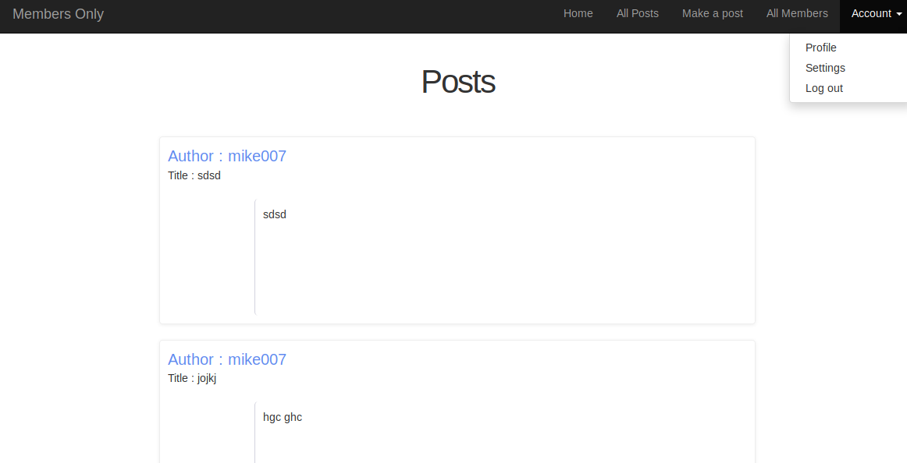

## MEMBERS-ONLY
A web based project where only member can view posts in the platform. Help better understand the idea of authentication.
Full description of the project can be found [Here, Odin Projects.](https://www.theodinproject.com/courses/ruby-on-rails/lessons/authentication)

## Instructions
- Clone Repository. run `git clone https://github.com/Urchmaney/members-only.git`.
- Change into directory. run `cd members-only`.
- From terminal run `bundle install`.
- If previous commands run successfully, run `rail s` to start application.

## Technologies
- Ruby
- Ruby on Rails
## AUTHORS

👤 **Kingsley Uche**

- Github: [@urchmaney](https://github.com/Urchmaney)
- Linkedin: [@urchamney](https://www.linkedin.com/in/kingsley-uche/)
- Twitter: [@urchmaney](https://twitter.com/kingsleyunegbu)

👤 **Samuel Cornet**

- Github: [@githubhandle](https://github.com/CornetS28)
